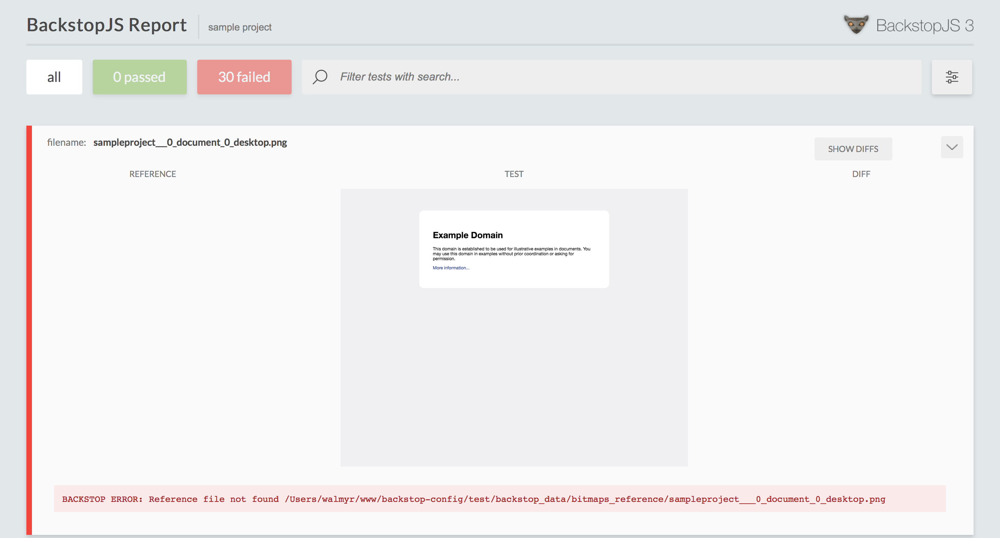
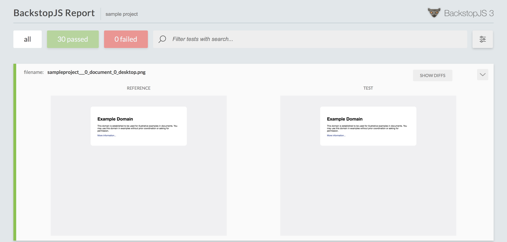
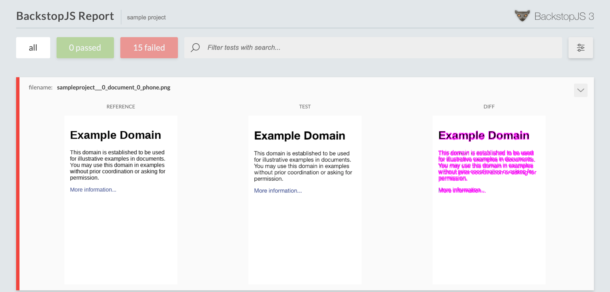

# backstop-config

A sample project with a simple implementation of [BackstopJS](https://github.com/garris/BackstopJS) tests that can be used by anyone who needs to run screenshot comparison tests in static web pages that have different relative URLs. E.g. http://example.com, http://example.com/page1, http://example.com/page2, etc.

## Pre-requirements

- [git](https://git-scm.com/downloads)
- [Node.js](https://nodejs.org/) (version 8 or greater)
- [Chrome](https://www.google.com/chrome/) browser

> To check the Node.js version installed in your computer, run `node -v`. You should see something like this `v10.13.0`. If you don't have Node.js installed, use the above link to download and install it.

## Installation

[Clone](https://help.github.com/articles/cloning-a-repository/) the project to your computer. Run `git clone https://github.com/wlsf82/backstop-config.git`.

Inside the directory of the cloned project, run `npm i` to install the project dependencies.

## Tests' setup

There is only one file you will have to change to get the project configured to run screenshot comparison tests for your website, which is [`test/basicConfig.js`](./test/basicConfig.js). Update this file by following the instructions in its comments.

> If you use Windows operating system, take a look at the [`NPM_SCRIPT_UPDATE_FOR_WINDOWS.md`](./NPM_SCRIPT_UPDATE_FOR_WINDOWS.md) file.

Done. You are ready to go!

## Running the tests

Run `npm t` to run the Backstop screenshot comparison tests against all the configured URLs of your website, in all the configured viewports.

### Running tests on Docker

Alternatively you can run the tests in a Docker container by running `npm run test:docker`.

> Note: For Windows and Mac users, Docker needs to be installed and running. It can be downloaded from the [dockerhub](https://hub.docker.com).

> For more information about running BackstopJS tests on Docker go to the [official documentation](https://github.com/garris/BackstopJS#using-docker-for-testing-across-different-environments).

## Approving bitmaps as references

In the first time running the tests, it is expected that all of them fail, and an HTML report should be automatically opened for you to review the taken screenshots. It will look like the one below.

If all the screenshots represent the correct state of the website, you can approve them as bitmaps references so that next time you run the tests, new screenshots will be taken, and compared with the approved ones.

Run `npm run backstop:approve` to approve the bitmaps as references to be used during the screenshot comparison tests.

## Re-running the tests

Re-run the tests with `npm t`.

After re-running the tests an HTML report like this should be available.

Done! Now every time you make changes that may affect the website visually, you can re-run the tests and get quick feedback to fix visual issues before deploying them to production.

> In case of test failures due to expected visual changes in the website, remember to re-approve the new screenshots as references. Use `npm run backstop:approve` to do so.

## Keeping track of bitmaps references

You can use [git](https://git-scm.com/downloads) to keep track of the bitmaps reference, also references in this document as screenshots references.

To do so you just need to commit the files in the `test/backstop_data/bitmaps_reference/` directory, as soon as you reviewed the screenshots, and they look good for usage in future comparisons.

## Test result with failures due to visual changes

Below you can see an example of the test report when BackstopJS finds a visual failure.

> In case the failure is due to a real visual bug, provide a fix and continue using the same bitmaps as references (there is no need to re-approve them.)

## Feedback

Your feedback is very important for this project. If you have any doubts or suggestions, open an issue, and I'll look into it as soon as possible.

## Contribute

This is an open source project. Feel free to [fork](https://help.github.com/articles/fork-a-repo/), improve it, and then create a [pull request](https://help.github.com/articles/about-pull-requests/). I'll be happy to review and have it merged when it gets in a good state.

___

Made with 💚 by [Walmyr Filho](http://walmyr-filho.com)
